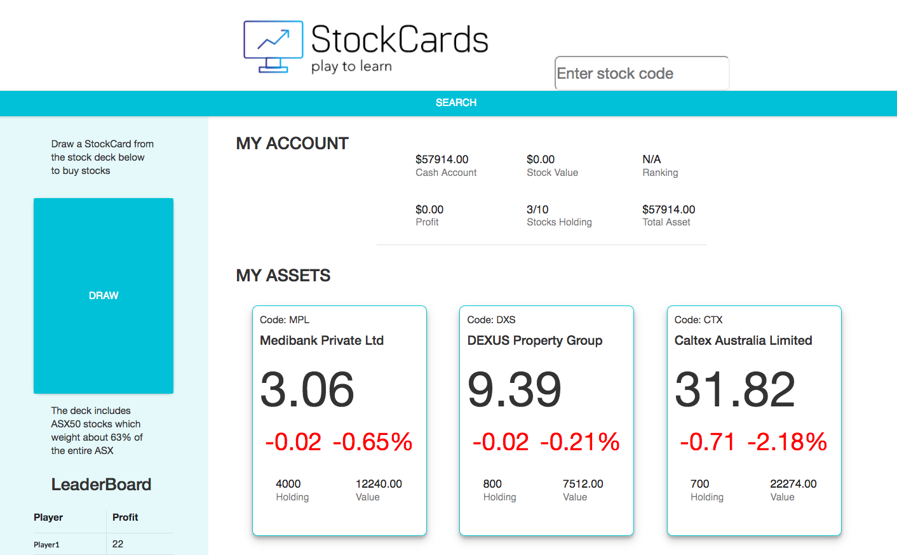

# StockCards App
## Technologies
- ReactJS
- Bootstrap
- SemanticUI
- MaterialUI
- Sinatra

<a href="https://cprobbie23.github.io/stock_cards/">Launch the app</a>

## Screenshot of the App

## Introduction
StockCards is an educational app that was designed to teach future investors who are interested in Australian Stock Market. I chose to include the ASX50 stocks to start with and encourage user to research before making any purchases.

## How to Play
Fetching stock data from Google Finance, this app allows you to view the data of any stocks by entering the stock code. However, you can only buy the stocks that you draw by clicking on the DRAW card. Each time you click on the DRAW card, you will be shown the information of a random stock.

## Future works
- SELL feature
- Update stock prices every 10 seconds
- Sum up the values of the stocks owned and add up to the total asset